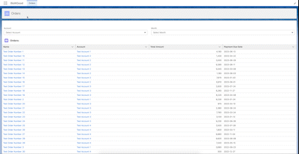

## Exam Task for Salesforce Courses JETBI - Autumn 2022
### Task name: 
Order Automation (Bid4Good) 

**Table content:**
* [General Info](#general-information)
* [Technologies Used](#technologies-used)
* [Screenshots](#screenshots)
* [Setup](#setup)
* [Usage](#usage)

### General Information
I needed to create an application that filters entries in a certain object based on two related criteria. In addition to the application, I needed to automate the sending of an email directly from the record interface.

### Technologies Used
* Custom Object configuration with relationships.
* SOQL queries (dynamic/static)
* Permission set
* Lightning application, Lightning web components
* CustomMetadata types
* Email Template
* Quick Action
* Custom Labels

### Screenshots
How it works.

Application home page.
![App page(./img/App%20Page.jpg)]
Record page of Order.

Email example.

## Setup
Project was made in with DX structure. So, for installing it into your Salesforce org you should:
1. Poll GitHub repoository to your project.
2. Connect with sandbox (authorize).
3. Push all metadata in sandbox.
4. In Sanbox assign permission set users, who need to use this application or metadata.
5. (If users email are not validated you must to validate to use 'Send Order' component work).
6. Test and use.

## Usage
#### Application Page
In Bid4Good application you can see table with Orders records and two picklists for filtering it.
The column on the table are sortable, so you can sorting by fild if you need.
In first picklist (left) by default are only Account they have at least one related Order or more.
If you want filtering Orders table by Account - choose Account in first picklist.
By default the second picklist do not have options. Options in this picklist will be dynamicly added after you choise Account in first picklist.
If you select the --None-- option, filtering on the table will be reset.
Orders and Accounts result on the table are clickable, if you want go to some record you can click on it to go.

#### Record Page
On the record page you can see standart layout with record datail.
You have a few button in right side - Send Order, Edit, Delete, Sharing.
Send Order are quick action for sending actiual record details to your email (authorized user, who click this button).
In a moment after click you will have Order Details in your email box.
